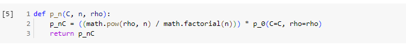
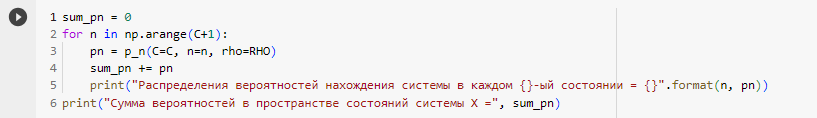
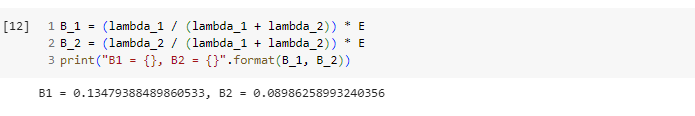
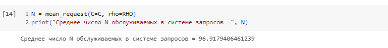
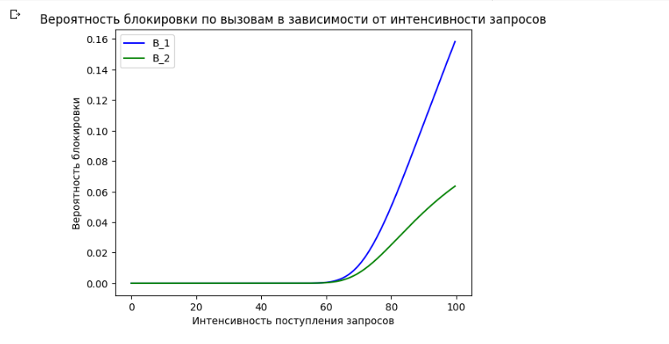
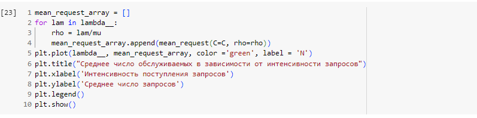

---
## Front matter
title: "Отчет по лабораторной работе №1"
subtitle: "Тема: Полнодоступная двухсервисная модель Эрланга с одинаковыми интенсивностями обслуживания"
author: "Выполнила:  Ким Реачна"

## Generic otions
lang: ru-RU
toc-title: "Содержание"

## Bibliography
bibliography: bib/cite.bib
csl: pandoc/csl/gost-r-7-0-5-2008-numeric.csl

## Pdf output format
toc: true # Table of contents
toc-depth: 2
lof: true # List of figures
fontsize: 12pt
linestretch: 1.5
papersize: a4
documentclass: scrreprt
## I18n polyglossia
polyglossia-lang:
  name: russian
  options:
	- spelling=modern
	- babelshorthands=true
polyglossia-otherlangs:
  name: english
## I18n babel
babel-lang: russian
babel-otherlangs: english
## Fonts
mainfont: PT Serif
romanfont: PT Serif
sansfont: PT Sans
monofont: PT Mono
mainfontoptions: Ligatures=TeX
romanfontoptions: Ligatures=TeX
sansfontoptions: Ligatures=TeX,Scale=MatchLowercase
monofontoptions: Scale=MatchLowercase,Scale=0.9
## Biblatex
biblatex: true
biblio-style: "gost-numeric"
biblatexoptions:
  - parentracker=true
  - backend=biber
  - hyperref=auto
  - language=auto
  - autolang=other*
  - citestyle=gost-numeric
## Pandoc-crossref LaTeX customization
figureTitle: "Рис."
listingTitle: "Листинг"
lofTitle: "Список иллюстраций"
lolTitle: "Листинги"
## Misc options
indent: true
header-includes:
  - \usepackage{indentfirst}
  - \usepackage{float} # keep figures where there are in the text
  - \floatplacement{figure}{H} # keep figures where there are in the text
---

# Теоретические сведения

Исследуется сота сети связи емкостью $C$. Пусть пользователям сети предоставляются услуги двух типов. Запросы в виде двух пуассоновский потоков (ПП) с интенсивностями $λ_1,λ_2$ поступают в соту. Среднее время обслуживания запросов на предоставление услуг каждого типа $μ_1^{-1},μ_2^{-1}$ соответственно. Исследуются основные характеристики модели для случая $μ_1= μ_2=μ$.

В классификации Башарина-Кендалла $MM|MM|C|0$.

Основные обозначения:

* $C$ - пиковая пропускная способность соты;
* $λ_1,λ_2$ - интенсивность поступления запросов на предоставление услуги 1, 2-го типа [запросов/ед.вр.];
* $μ^{-1}$ - среднее время обслуживания запроса на предоставление услуги 1, 2-го типа [запросов/ед.вр.];
* $ρ_1,ρ_2$ - интенсивность предложенной нагрузки,создаваемой запросами на предоставление услуги 1, 2-го типа;
* $X(t)$ - число запросов, обслуживаемых в системе в момент времени $t , t ≥ 0$ (случайный процесс (СП), описывающий функционирование системы в момент времени $t , t ≥ 0$);
* $X$ - пространство состояний системы;
* $n$ - число обслуживаемых в системе запросов;
* $B_1, B_2$ - множество блокировок запросов на предоставление услуги 1, 2-го типа;
* $S_1,S_2$ - множество приема запросов на предоставление услуги 1, 2-го типа.

Схема модели (рис. @fig:001):

{#fig:001}

Пространство состояний системы (рис. @fig:002):
\begin{equation}
\tag{1.1}
{X}={0,…,C},{|X|} = C + 1
\end{equation}

{#fig:002}

Множество блокировок запросов на предоставление услуги $i$-типа, $i$=1,2:
\begin{equation}
\tag{1.2}
B_1= B_2={C}
\end{equation}

Множество приема запросов на предоставление услуги $i$-типа, $i$=1,2:
\begin{equation}
\tag{1.3}
S_i = \bar{{B_i}} = {X} \backslash {B_i} = \{0,1,,,.,C-1\}
\end{equation}

Система уравнений глобального баланса (СУГБ):

\begin{equation}
\tag{1.4}
\begin{cases}
    (\lambda_1 + \lambda_2) p_0 = μ p_1, \\
    (\lambda_1 + \lambda_2 + n\mu)p_n = (\lambda_1 + \lambda_2)p_{n-1} + (n+1)\mu p_{n+1}, n = \overline{{1,C-1}}, \\
    C\mu p_C = (\lambda_1 + \lambda_2)p_{C-1}
\end{cases}
\end{equation}

Система уравнений локального баланса (СУЛБ):
\begin{equation}
\tag{1.5}
(\lambda_1+\lambda_2)p_{n-1} = n \mu p_n ,    n = \overline{1, C}
\end{equation}

Стационарное распределение вероятностей состояний системы:
\begin{equation}
\tag{1.6}
p_n = \left( \sum_{i=0}^{C}{\frac{(\rho_1+\rho_2)^{i}}{i!}}\right)^{-1}. \frac{\left(\rho_1+\rho_2\right)^{n}}{n!}, n = \overline{0, C}
\end{equation}

**Доказательство:**

Используя СУЛБ, найдем стационарное распределение вероятностей состояний системы $p_n, n=\overline{1, C}:$

$$
p_n [C] = p_n = p_{n-1}. \frac{\lambda_1+\lambda_2}{n\mu} = p_{n_1}. \frac{\rho_1+\rho_2}{n} = ... = p_0. \frac{(\rho_1+\rho_2)^{n}}{n!}, n = \overline{1, C}
$$

Для нахождения вероятности $p_0$ воспользуемся условием нормировки $\sum_{n=0}^{C} p_n = 1$:

$$
p_0 = p_0 [C] = \left(\sum_{n = 0}^{C} {\frac{(\rho_1+\rho_2)^{n}}{n!}}\right)^{-1}
$$

Основные вероятностные характеристики (ВХ) модели:

* Вероятность блокировки по времени $E_i$ запроса на предоставление услуги $i$-типа, $i=1,2$:

\begin{equation}
\tag{1.7}
E_1 = E_2 = E[C]= \sum_{n\in B_i} p_n = p_C[C]
\end{equation}

* Вероятность блокировки по вызовам $B_i$ запроса на предоставление услуги $i$-типа, $i=1,2$:

\begin{equation}
\tag{1.8}
B_i = \frac{\lambda_i}{\lambda_1+\lambda_2} . E[C],
\end{equation}
где $\frac{\lambda_i}{\lambda_1+\lambda_2} -$ вероятность того, что поступит запрос на предоставление услуги $i$ -типа;

* Вероятность блокировки по нагрузке $C_i$ запроса на предоставление услуги $i$-типа, $i=1,2$:

\begin{equation}
\tag{1.9}
C_1=C_2=E[C]
\end{equation}

* Среднее число $\bar{N}$ обслуживаемых в системе запросов:
\begin{equation}
\tag{1.10}
\bar{N} = \sum_{n\in X} np_n .
\end{equation}

# Численный анализ

Создание программы, реализующей расчет распределения вероятностей,
вероятности блокировки, среднего количества обслуженных запросов для любых значений исходных данных. Программа должна выводить на экран:

* значение распределения вероятностей;
* значения вероятностей блокировки;
* значение среднего числа заявок.

Код написан на языке Python в Google Colab:

Определение функции $p_0$ для вычисления вероятности того, что система находится в исходном состоянии:

Определение функции $p_n$ для вычисления вероятности того, что система находится в n состоянии:

Определения функция $p_C$ для вычисления вероятности блокировки по нагрузке и по времени $C_1=C_2=E$, в которой $n=C$:

Определение функций **mean_request** для вычисления среднего число запросов в системе $\bar N$:

Для расчета основных вероятностных характеристик модели были взяты следующие параметры:

\begin{equation}
 C = 100, μ_1=μ_2=μ=0.8, λ_1=40, λ_2=60
\end{equation}

Заметить что:

$ρ_1=λ_1/μ_1$

$ρ_2=λ_2/μ_2$

Значения стационарного распределения вероятностей в состоянии $n$ и общей суммы:

Вероятность блокировки по времени $E$:

Вероятность блокировки по вызовам $B_i$:

Среднее число обслуживаемых в системе запросов $\bar N$:

* Построение график зависимости вероятности блокировки от интенсивности поступления запросов на обслуживание

* Построение график среднего числа обслуживаемых запросов от интенсивности поступления запросов:

