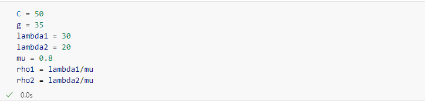
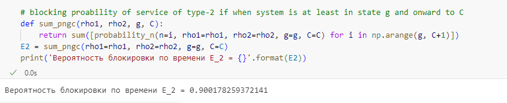

---
## Front matter
title: "Отчет по лабораторной работе №2"
subtitle: "Тема: Неполнодоступная двухсервисная модель Эрланга с одинаковыми интенсивностями обслуживания и зарезервированной емкостью"
author: "Выполнила:  Ким Реачна"

## Generic otions
lang: ru-RU
toc-title: "Содержание"

## Bibliography
bibliography: bib/cite.bib
csl: pandoc/csl/gost-r-7-0-5-2008-numeric.csl

## Pdf output format
toc: true # Table of contents
toc-depth: 2
lof: true # List of figures
fontsize: 12pt
linestretch: 1.5
papersize: a4
documentclass: scrreprt
## I18n polyglossia
polyglossia-lang:
  name: russian
  options:
	- spelling=modern
	- babelshorthands=true
polyglossia-otherlangs:
  name: english
## I18n babel
babel-lang: russian
babel-otherlangs: english
## Fonts
mainfont: PT Serif
romanfont: PT Serif
sansfont: PT Sans
monofont: PT Mono
mainfontoptions: Ligatures=TeX
romanfontoptions: Ligatures=TeX
sansfontoptions: Ligatures=TeX,Scale=MatchLowercase
monofontoptions: Scale=MatchLowercase,Scale=0.9
## Biblatex
biblatex: true
biblio-style: "gost-numeric"
biblatexoptions:
  - parentracker=true
  - backend=biber
  - hyperref=auto
  - language=auto
  - autolang=other*
  - citestyle=gost-numeric
## Pandoc-crossref LaTeX customization
figureTitle: "Рис."
listingTitle: "Листинг"
lofTitle: "Список иллюстраций"
lolTitle: "Листинги"
## Misc options
indent: true
header-includes:
  - \usepackage{indentfirst}
  - \usepackage{float} # keep figures where there are in the text
  - \floatplacement{figure}{H} # keep figures where there are in the text
---

# Теоретические сведения

Рассмотрим звено сети емкостью $C$. Пусть пользователям сети предоставляются услуги двух
типов. Запросы на предоставление услуг представляют собой (ПП) с интенсивностями $λ_1,λ_2$. Среднее время обслуживания запросов каждого типа $μ_1^{-1},μ_2^{-1}$ соответственно. Рассмотрим случай $μ_1= μ_2=μ$. 

Часть пропускной способности соты зарезервирована для обслуживания запросов на предоставление услуги 1-го или 2-го типа. Оставшаяся часть пропускной способности является полнодоступной для запросов на предоставление услуг обоих типов. Предположим, что сначала заполняется полнодоступная емкость. 

В классификации Башарина-Кендалла $MM|MM|C,g|0$.

Основные обозначения:

* $C$ - пиковая пропускная способность соты;
* $g$ - полнодоступная часть пропускной способности соты; 
* $C-g$ - пропускная способность, зарезервированная для обслуживания запросов на предоставление услуги 1-го или 2-го типа;
* $λ_1,λ_2$ - интенсивность поступления запросов на предоставление услуги 1, 2-го типа [запросов/ед.вр.];
* $μ^{-1}$ - среднее время обслуживания запроса на предоставление услуги 1, 2-го типа [запросов/ед.вр.];
* $ρ_1,ρ_2$ - интенсивность предложенной нагрузки,создаваемой запросами на предоставление услуги 1, 2-го типа;
* $X(t)$ - число запросов, обслуживаемых в системе в момент времени $t , t ≥ 0$ (случайный процесс (СП), описывающий функционирование системы в момент времени $t , t ≥ 0$);
* $X$ - пространство состояний системы;
* $n$ - число обслуживаемых в системе запросов;
* $B_1, B_2$ - множество блокировок запросов на предоставление услуги 1, 2-го типа;
* $S_1,S_2$ - множество приема запросов на предоставление услуги 1, 2-го типа.

Пусть часть пропускной способности соты $C-g$ зарезервирована для обслуживания запросов на предоставление услуги 1-го типа. 

Схема модели (рис. @fig:001):

{#fig:001}

Пространство состояний системы (рис. @fig:002):
\begin{equation}
\tag{2.1}
{X}=\{0,…,C\},{|X|} = C + 1
\end{equation}

{#fig:002}

**Множество блокировок запросов на предоставление услуги $i$-типа**, $i$=1,2:

\begin{equation}
\tag{2.2}
B_1=\{C\}
\end{equation}

\begin{equation}
\tag{2.3}
B_2=\{g,g+1,...,C\}
\end{equation}

**Множество приема запросов на предоставление услуги $i$-типа**, $i$=1,2:

\begin{equation}
\tag{2.4}
S_1 = \bar{{B_1}} = {X} \backslash {B_1} = \{0,...,C-1\}
\end{equation}

\begin{equation}
\tag{2.5}
S_2 = \bar{{B_2}} = {X} \backslash {B_2} = \{0,...,C_2-1\}
\end{equation}


**Система уравнений глобального баланса (СУГБ):**

\begin{equation}
  \tag{2.6}
  \begin{cases}
    (\lambda_1 + \lambda_2) p_0 = μ p_1, \\
    (\lambda_1 + \lambda_2 + n\mu)p_n = (\lambda_1 + \lambda_2)p_{n-1} + (n+1)\mu p_{n+1}, n = \overline{{1,g-1}}, \\
    (\lambda_1 + g\mu)p_g = (\lambda_1 + \lambda_2)p_{g-1} + (g+1)\mu p_{g+1}, \\
    (\lambda_1 + n\mu)p_n = \lambda_1 p_{n-1} + (n+1)\mu p_{n+1}, n = \overline{{g+1,C-1}}, \\
    C\mu p_C = \lambda_1 p_{C-1}
  \end{cases}
\end{equation}

**Система уравнений локального баланса (СУЛБ):**

\begin{equation}
\tag{2.7}
\begin{cases}
(\lambda_1+\lambda_2)p_{n-1} = n \mu p_n ,    n = \overline{1, g}, \\
\lambda_1 p_{n-1} = n\mu p_n, n = \overline{{g+1,C}}
\end{cases}
\end{equation}

Обозначим:

$$
  \rho_1 = \frac{\lambda_1}{\mu}, \rho_2 = \frac{\lambda_2}{\mu}
$$

**Стационарное распределение вероятностей состояний системы:**

\begin{equation}
\tag{2.8}
p_n = 
\begin{cases}
p_0 . \frac{(\rho_1+\rho_2)^{n}}{n!}, n=\overline{{1,g}} \\
p_0 . \frac{(\rho_1+\rho_2)^{g} . (\rho_1)^{n-g}}{n!}, n=\overline{{g+1,C}}
\end{cases}
\end{equation}

где: 

\begin{equation}
\tag{2.9}
p_0=\left(\sum_{n=1}^{g} {\frac{(\rho_1+\rho_2)^{n}}{n!}} + \sum_{n=g+1}^{C} {\frac{(\rho_1+\rho_2)^{g} . (\rho_1)^{n-g}}{n!}}\right)^{-1}
\end{equation}


**Основные вероятностные характеристики модели:**

* Вероятность блокировки по времени $E_1$ запроса на предоставление услуги 1-го типа

\begin{equation}
\tag{2.10}
E_1 = \sum_{n\in B_1} p_n = p_C
\end{equation}

* Вероятность блокировки по времени $E_1$ запроса на предоставление услуги 2-го типа

\begin{equation}
\tag{2.11}
E_2 = \sum_{n\in B_2} p_n = p_g + p_{g+1} + ...+ p_C = \sum_{n=g}^{C} p_n
\end{equation}

* Среднее число $\bar N$ обслуживаемых в системе запросов:
\begin{equation}
\tag{2.12}
\bar N = \sum_{n\in X} np_n
\end{equation}


# Численный анализ

Для расчета основных вероятностных характеристик модели были взяты следующие параметры:

\begin{equation}
\tag{2.13}
C = 50, g = 35, μ_1=μ_2=μ=0.8, λ_1=30, λ_2=20
\end{equation}

Код написан на языке Python в Google Colab:


```python
import numpy as np
import math
```








