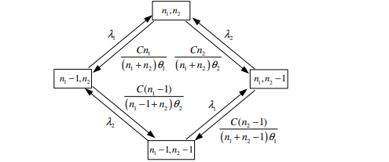

---
## Front matter
title: "Отчет по лабораторной работе №3: Двухсервисная модель с эластичным трафиком"
subtitle: "Дисциплина: Основы проектирования сетей и систем телекоммуникаций"
author: "Выполнила:  Ким Реачна, НПИбд-01-20"

## Generic otions
lang: ru-RU
toc-title: "Содержание"

## Bibliography
bibliography: bib/cite.bib
csl: pandoc/csl/gost-r-7-0-5-2008-numeric.csl

## Pdf output format
toc: true # Table of contents
toc-depth: 2
lof: true # List of figures
fontsize: 12pt
linestretch: 1.5
papersize: a4
documentclass: scrreprt
## I18n polyglossia
polyglossia-lang:
  name: russian
  options:
	- spelling=modern
	- babelshorthands=true
polyglossia-otherlangs:
  name: english
## I18n babel
babel-lang: russian
babel-otherlangs: english
## Fonts
mainfont: PT Serif
romanfont: PT Serif
sansfont: PT Sans
monofont: PT Mono
mainfontoptions: Ligatures=TeX
romanfontoptions: Ligatures=TeX
sansfontoptions: Ligatures=TeX,Scale=MatchLowercase
monofontoptions: Scale=MatchLowercase,Scale=0.9
## Biblatex
biblatex: true
biblio-style: "gost-numeric"
biblatexoptions:
  - parentracker=true
  - backend=biber
  - hyperref=auto
  - language=auto
  - autolang=other*
  - citestyle=gost-numeric
## Pandoc-crossref LaTeX customization
figureTitle: "Рис."
listingTitle: "Листинг"
lofTitle: "Список иллюстраций"
lolTitle: "Листинги"
## Misc options
indent: true
header-includes:
  - \usepackage{indentfirst}
  - \usepackage{float} # keep figures where there are in the text
  - \floatplacement{figure}{H} # keep figures where there are in the text
---

# Теоретические сведения

Проаназируем соту сети емкостью $C$ . Пусть пользователи генерируют запросы на передачу данных двух типов. Запросы на передачу данных представляют собой ПП с интенсивностью $\lambda_i$, $i =1,2$. Средняя длина передаваемого файла $θ_i, i=1,2$. Минимальная емкость, необходимая для передачи данных равна $b_i, i=1,2$.

Основные обозначения:

* C - пиковая пропускная способность соты;
* $λ_i$, $i=1,2$ - интенсивность поступления запросов на передачу данных первого/второго типа [запросов/ед.вр];
* $θ_i$, $i=1,2$ - длина передаваемого файла первого/второго типа [бит];
* $\rho_{i}^1$, $i=1,2$ - интенсивность предложенной нагрузки, создаваемой запросами на передачу данных первого/второго типа;
* $a_i, i=1,2$ - доля нагрузки,создаваемой запросами на передачу данных первого/второго типа, которая приходится на единицу пропускной способности (безразмерная величина);
* $b_i, i=1,2$ - минимальное требование к ресурсам сети, необходимое для передачи данных первого/второго типа;
* $X_i(t), i=1,2$ - число обслуживаемых в системе запросов на передачу данных первого/второго типа в момент времени $t , t ≥ 0$ ;
* $X(t)=(X_1(t),(X_2(t))$ - СП, описывающий функционирование системы в момент времени $t , t ≥ 0$ ;
* $X$ - пространство состояний системы;
* $n_i, i=1,2$ - число передаваемых в системе блоков данных первого/второго типа;
* $B_i, i=1,2$ - множество блокировок запросов на передачу данных первого/второго типа;
* $S_i, i=1,2$ - множество приема запросов на передачу данных первого/второго типа.

Схема модели (рис. @fig:001):

{#fig:001}

Пространство состояний системы (рис. @fig:002):
\begin{equation}
\tag{11.1}
{X}= \{(n_1,n_2):n_1 \geq 0, n_2 \geq 0\}.
\end{equation}

Рассмотрим некоторое центральное состояние $(n_1,n_2), (n_1,n_2) \in X$. Построим диаграмму интенсивностей переходов для центрального состояния (рис. @fig:002):

{#fig:002}

Пояснения:

- $\frac{C}{n_1+n_2}$ - скорость передачи данных первого/второго типа в состоянии $(n_1,n_2)$;

- $\frac{\theta_1}{\frac{C}{n_1+n_2}} = \frac{\theta_1}{C} (n_1+n_2)$ - среднее время обслуживания запроса на передачу данных первого типа в состоянии $(n_1,n_2)$;

- $\frac{\theta_2}{\frac{C}{n_1+n_2}} = \frac{\theta_2}{C} (n_1+n_2)$ - среднее время обслуживания запроса на передачу данных второго типа в состоянии $(n_1,n_2)$;

- $\frac{C}{\theta_1 (n_1+n_2)}$ - интенсивность обслуживания запроса на передачу данных первого типа в состоянии $(n_1,n_2)$;

- $\frac{C}{\theta_2 (n_1+n_2)}$ - интенсивность обслуживания запроса на передачу данных второго типа в состоянии $(n_1,n_2)$.

**Множество блокировок запросов на передачу данных:**

\begin{equation}
\tag{11.2}
B_i=\{\emptyset\}, i=1,2
\end{equation}

**Множество приема запросов на передачу данных:**

\begin{equation}
\tag{11.3}
S_i=\bar B_i=X\backslash B_i=\{0,1,2,...\}, i=1,2.
\end{equation}

**Система уравнений глобального баланса (СУГБ):**

\begin{equation}
\tag{11.4}
\begin{aligned}
& \left( \lambda_1 + \lambda_2 + \frac{C}{(n_1 + n_2)\theta_1}n_1 + \frac{C}{(n_1 + n_2)\theta_2}n_2 \right) .p(n_1, n_2) \\
& = \lambda_1 p(n_1 - 1, n_2) U(n_1) + \lambda_2 p(n_1, n_2 - 1) .U(n_2) \\
& \quad + \frac{C}{(n_1 + 1 + n_2)\theta_1} (n_1 + 1) p(n_1 + 1, n_2) \\
& \quad + \frac{C}{(n_1 + n_2 + 1)\theta_2} (n_2 + 1) p(n_1, n_2 + 1), (n_1,n_2) \in X.
\end{aligned}
\end{equation}

Чтобы выписать систему уравнений частичного баланса (СУЧБ), проверим критерий Колмогорова. Рассмотрим произвольный замкнутый контур (рис. @fig:003): 

{#fig:003}

Рассмотрим произведение интенсивностей переходов:

- по часовой стрелке:
\begin{equation}
\frac{n_2}{n_1+n_2}\frac{C}{\theta_2}\frac{n_1}{n_1+n_2-1}\frac{C}{\theta_1} \lambda_1\lambda_2;
\end{equation}

- против часовой стрелки:
\begin{equation}
\frac{n_1}{n_1+n_2}\frac{C}{\theta_1}\frac{n_2}{n_1+n_2-1}\frac{C}{\theta_2}\lambda_1\lambda_2.
\end{equation}

Произведения равны. Критерий выполнен, следовательно СП $\left(X_1(t),X_2(t)\right)$, описывающий поведение системы является обратимым марковским процессом, СУЧБ существует.

СУЧБ:

\begin{equation}
\tag{11.5}
\begin{cases}
p(n_1,n_2)\frac{C}{(n_1+n_2)\theta_1}n_1 = \lambda_1p(n_1-1,n_2),n_1>0, \\
p(n_1,n_2)\frac{C}{(n_1+n_2)\theta_2}n_2 = \lambda_1p(n_1,n_2-1),n_2>0, (n_1,n_2) \in X.
\end{cases}
\end{equation}

Обозначим
$\rho_i=\lambda_i\theta_i, a_i=\frac{\rho_i}{C}, \rho_i<C, i=1,2$

**Стационарное распределение вероятностей состояний системы:**

\begin{equation}
\tag{11.6}
p(n_1,n_2)=\frac{a_1^{n_1}}{n_1!}\frac{a_2^{n_2}}{n_2!}(n_1+n_2)!p(0,0),
\end{equation}

где: \begin{equation}
\tag{11.7}
p(0,0)= \left(\sum_{(n_1,n_2)\in X}{(n_1+n_2)!}\frac{a_1^{n_1}}{n_1!}\frac{a_2^{n_2}}{n_2!}\right)^{-1}
\end{equation}

**Основные вероятностные характеристики модели:**

- Вероятность блокировки по времени $E_i , i =1,2$ запроса на передачу данных первого/второго типа:

\begin{equation}
\tag{11.8}
E_1=E_2=0;
\end{equation}

- Среднее число $\bar {N_i} , i =1,2$ обслуживаемых в системе запросов на передачу данных первого/второго типа:

\begin{equation}
\tag{11.9}
\bar N_i=\lambda_i\frac{\theta_i}{(\theta_1\lambda_1+\theta_2\lambda_2)}, i=1,2
\end{equation}

- Среднее время $T_i, i =1,2$ обслуживания запроса на передачу данных первого/второго типа:

\begin{equation}
\tag{11.10}
T_i=\frac{\bar N_i}{\lambda_i}
\end{equation}

# Численный анализ

Для расчета основных вероятностных характеристик модели были взяты следующие параметры:

\begin{equation}
C = 50, \theta_1=4, \theta_2=7, λ_1=9, λ_2=6
\end{equation}

Код написан на языке Python в Google Colab:

