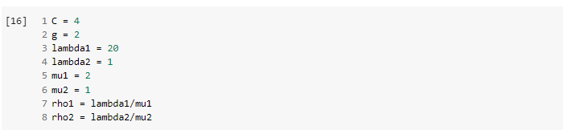
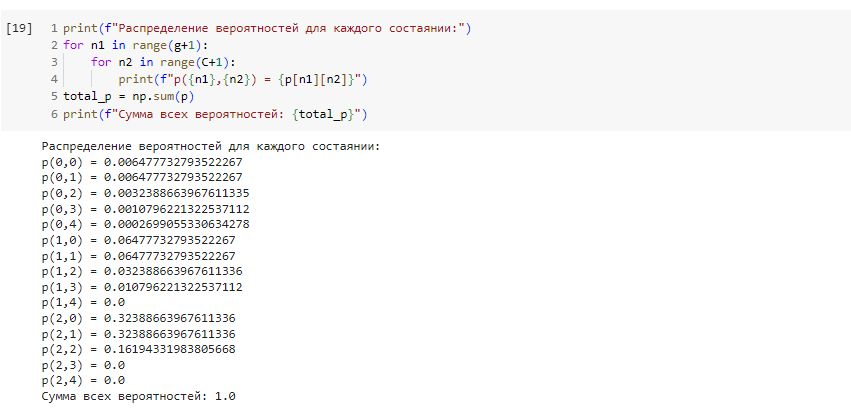

---
## Front matter
title: "Отчет по лабораторной работе №4: Неполнодоступная двухсервисная модель Эрланга с резервированием для второго типа и различными интенсивностями обслуживания. Первыми заполняются зарезервированные приборы"
subtitle: "Дисциплина: Основы проектирования сетей и систем телекоммуникаций"
author: "Выполнила:  Ким Реачна, НПИбд-01-20"

## Generic otions
lang: ru-RU
toc-title: "Содержание"

## Bibliography
bibliography: bib/cite.bib
csl: pandoc/csl/gost-r-7-0-5-2008-numeric.csl

## Pdf output format
toc: true # Table of contents
toc-depth: 2
lof: true # List of figures
fontsize: 12pt
linestretch: 1.5
papersize: a4
documentclass: scrreprt
## I18n polyglossia
polyglossia-lang:
  name: russian
  options:
	- spelling=modern
	- babelshorthands=true
polyglossia-otherlangs:
  name: english
## I18n babel
babel-lang: russian
babel-otherlangs: english
## Fonts
mainfont: PT Serif
romanfont: PT Serif
sansfont: PT Sans
monofont: PT Mono
mainfontoptions: Ligatures=TeX
romanfontoptions: Ligatures=TeX
sansfontoptions: Ligatures=TeX,Scale=MatchLowercase
monofontoptions: Scale=MatchLowercase,Scale=0.9
## Biblatex
biblatex: true
biblio-style: "gost-numeric"
biblatexoptions:
  - parentracker=true
  - backend=biber
  - hyperref=auto
  - language=auto
  - autolang=other*
  - citestyle=gost-numeric
## Pandoc-crossref LaTeX customization
figureTitle: "Рис."
listingTitle: "Листинг"
lofTitle: "Список иллюстраций"
lolTitle: "Листинги"
## Misc options
indent: true
header-includes:
  - \usepackage{indentfirst}
  - \usepackage{float} # keep figures where there are in the text
  - \floatplacement{figure}{H} # keep figures where there are in the text
---

# Теоретические сведения

Рассмотрим звено сети емкостью $С$. Пусть пользователям сети предоставляются услуги двух типов. Запросы на предоставление услуг представляют собой ПП с интенсивностями $\lambda_1, \lambda_2$. Среднее время обслуживания запросов каждого типа $\mu_1^{-1}$, $\mu_2^{-1}$ соответственно. Рассмотрим случай равенства $\mu$. Часть пропускной способности соты зарезервирована для обслуживания запросов на предоставление услуги 2-го типа. Оставшаяся часть пропускной способности является полнодоступной для запросов на предоставление услуг обоих типов. Предположим, что сначала заполняются зарезервированные приборы.

Основные обозначения:

* $C$ - общее число приборов;
* $g$ - число полнодоступных приборов;
* $C-g$ -число полнодоступных приборов;
* $λ_1,λ_2$ - интенсивность поступления заявок $1, 2$-го типа [заявок/ед.вр.];
* $μ^{-1}$ - среднее время обслуживания заявки $1, 2$-го типа [ед.вр.];
* $ρ_1,ρ_2$ - интенсивность предложенной нагрузки, создаваемой заявками $1, 2$-го типа;
* $X(t)$ - число заявок, обслуживаемых в системе в момент времени $t , t ≥ 0$
* $X$ - пространство состояний системы;
* $n$ - число обслуживаемых в системе заявок;
* $B_1, B_2$ - множество блокировки заявок $1, 2$-го типа;
* $S_1,S_2$ - множество приема заявок $1, 2$-го типа.

Схема модели (рис. @fig:001):

{ #fig:001 width=40% height=40%}

Пространство состояний системы (рис. @fig:002):

\begin{equation}
\tag{4.1}
X = \{(n_1,n_2):n_1 = \overline {0,g}, n_2 = \overline {0,C}, n_1+n_2 \leq C\}
\end{equation}

{ #fig:002 width=40% height=40%}

{ #fig:003 width=80% height=80%}

**Множество блокировок запросов на предоставление услуги $i$ -типа, $i =1,2$ :**

\begin{equation}
\tag{4.2}
B_1 = \{(n_1,n_2) \in X: n_1=g \vee n_1+n_2 = C\}
\end{equation}

\begin{equation}
\tag{4.3}
B_2= \{(n_1,n_2) \in X: n_1+n_2=C\}
\end{equation}

**Множество приема запросов на предоставление услуги $i$ -типа, $i=1,2$:**

\begin{equation}
\tag{4.4}
S_1= \{(n_1,n_2) \in X:n_1 < g \vee n_1+n_2 < C\}
\end{equation}

\begin{equation}
\tag{4.5}
S_2 = \{(n_1,n_2) \in X: n_1+n_2 < C \}
\end{equation}

**СУГБ:**

\begin{equation}
\tag{4.6}
\begin{cases}
\begin{aligned}
1) &\ p(n_1,n_2)(\lambda_1+\lambda_2+(n_1+n_2)\mu) \nonumber \\
&= p(n_1-1,n_2)\lambda_1+p(n_1,n_2-1)\lambda_2 \nonumber \\
&\quad + p(n_1+1,n_2)(n_1+1)\mu + p(n_1,n_2+1)(n_2+1)\mu, \\
& n_1 = \overline {1,g-1}, n_2 = \overline {1,C-1} \nonumber 
\\
2) &\ p(n_1,0)(\lambda_1+\lambda_2+n_1\mu) \nonumber \\
&= p(n_1-1,0)\lambda_1+p(n_1+1,0)(n_1+1)\mu_1+p(n_{1,1}\mu_2), \\
&\quad n_1 = \overline {1,g-1};\nonumber
\\
3) &\ p(0,n_2)(\lambda_1+\lambda_2+n_2\mu) \nonumber \\
&= p(0, n_2-1)\lambda_2+p(1,n_2)\mu+p(0,n_2+1)(n_2+1)\mu, \nonumber \\
&\quad n_2=\overline {1,C-1} \nonumber
\\
4) &\ p(n_1,C-n_1)(n_1\mu+(C-n_1)\mu) \nonumber \\
&= p(n_1-1,C-n_1)\lambda_1+p(n_1,C-n_1-1)\lambda_2, \nonumber \\
&\quad n_1 = \overline {1,g}
\\
5) &\ p(0,0)(\lambda_1,\lambda_2)=p(1,0)\mu+p(0,1)\mu \nonumber
\\
6) &\ p(0,C)C\mu=\lambda_2p(0,C-1) \nonumber
\\
7) &\ p(g,0)(\mu+\lambda_2) \nonumber \\
&= p(g-1,0)\lambda_1+p(g,1)\mu \nonumber
\\
8) &\ p(g,n_2)(\lambda_2+g\mu+n_2\mu) \nonumber \\
&= p(g,n_2+1)(n_2+1)\mu+p(g-1,n_2)\lambda_1 +p(g,n_2-1)\lambda_2 \nonumber \\
&\quad n_2 = \overline {0,c-g-1}
\end{aligned}
\end{cases}
\end{equation}

**СУЛБ:**

\begin{equation}
\tag{4.7}
\begin{cases}
p(n_1,n_2)n_1\mu_1 = p(n_1-1,n_2)\lambda_1, n_1>0, \\
p(n_1,n_2)n_2\mu_2 = p(n_1,n_2-1)\lambda_2, n_2>0, (n_1,n_2) \in X
\end{cases}
\end{equation}

Обозначим 
\begin{equation}
\rho_1 = \frac{\lambda_i}{\mu_i}, i=1,2
\end{equation}

**Стационарное распределение вероятностей состояний системы:**

\begin{equation}
\tag{4.8}
p(n_1,n_2) = p(0,0) \cdot \frac{\rho_{2}^{n_2}}{n_2!} \cdot \frac{\rho_{1}^{n_1}}{n_1!} 
\end{equation}

где:

\begin{equation}
\tag{4.9}
p(0,0) = \left( \sum_{(n_1,n_2) \in X} \frac{\rho_{2}^{n_2}}{n_2!}.\frac{\rho_{1}^{n_1}}{n_1!} \right)^{-1}
\end{equation}

**Основные вероятностные характеристики модели:**

- Вероятность блокировки заявок на предоставление услуги 1-ог типа:

\begin{equation}
\tag{4.11}
B_1=\sum_{(n_1,n_2)\in {B_1}} p(n_1,n_2)
\end{equation}

- Вероятность блокировки заявок на предоставление услуги 2-ог типа:

\begin{equation}
\tag{4.12}
B_2=\sum_{(n_1,n_2)\in {B_2}} p(n_1,n_2)
\end{equation}

- Среднее число $\bar N$ обслуживаемых в системе запросов

\begin{equation}
\tag{4.13}
\bar N = \sum_{(n_1,n_2) \in X}(n_1+n_2)p(n_1,n_2)
\end{equation}

# Численный анализ

Для расчета основных вероятностных характеристик модели были взяты следующие параметры:

\begin{equation}
C = 4, g = 2, \lambda_1 = \overline {1,20}, \lambda_2 = 1, \mu_1 = 2, \mu_2 = 1
\end{equation}

Диаграмма интенсивностей переходов имеет следующий вид (рис. @fig:004):

{ #fig:004 width=50% height=50%}

Постранство состояний:

\begin{equation}
X = \{(n_1,n_2):n_1 = \overline {0,2}, n_2 = \overline {0,4}, n_1+n_2 \leq C\}, |X| = 12
\end{equation}

Множества блокировок запросов $B_1,B_2$:

\begin{equation}
\begin{aligned}
&\ B_1 = \{(n_1,n_2) \in X: n_1=2 \vee n_1+n_2 = 4\}, \\
\\
&\ B_1 = \{(0,4),(1,3), (2,2), (2,1), (2,0)\}
\end{aligned}
\end{equation}

\begin{equation}
\begin{aligned}
&\ B_2= \{(n_1,n_2) \in X: n_1+n_2=4\}, \\
\\
&\ B_2 = \{(0,4), (1,3), (2,2)\}
\end{aligned}
\end{equation}

Множества приема запросов $S_1, S_2$:

\begin{equation}
\begin{aligned}
&\ S_1= \{(n_1,n_2) \in X:n_1 < 2 \vee n_1+n_2 < 4\},  \\
\\
&\ S_1 = \{(0,0), (0,1), (0,2), (0,3), (1,0), (1,1), (1,2)\}
\end{aligned}
\end{equation}

\begin{equation}
\begin{aligned}
&\ S_2 = \{(n_1,n_2) \in X: n_1+n_2 < 4 \}, \\
\\
&\ S_2 = \{(0,0), (0,1), (0,2), (0,3), (1,0), (1,1), (1,2), (2,0), (2,1)\}
\end{aligned}
\end{equation}

Код написан на языке Python в Google Colab:

